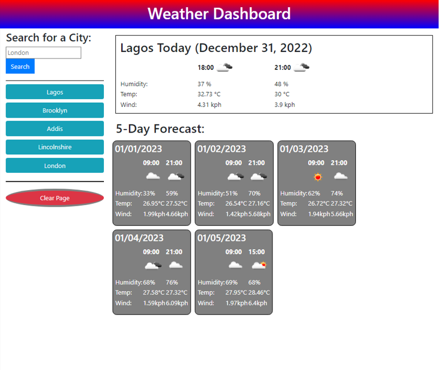
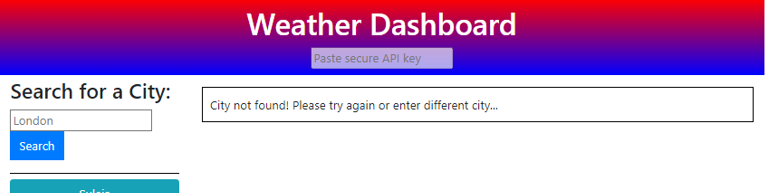

# weather-site
User-friendly website that loads current and future weather conditions using the 5-days 3-hours interval forecast API on [Open Weather Map](https://openweathermap.org/). The weather conditions displayed on this site are humidity, temperature and wind speed.

The live deployment of this website is available [here](https://enwokedi96.github.io/weather-site/).

The entire website is split into 3 mainsections; 
* The search and history section: has an input field which takes in the city or region for which the user wishes to display the weather. This section also logs the history of searches as buttons. When clicked, these buttons load  and display the previously seen forecasts. Finally, a nice red button was added to clear the user screen and all stored data.
* The 'todays forecast' section: displays all the available future weather predictions for the current day. The data is presented as a table with values and icons in place for each relevant time.
* The 5-days forecast section: displays forecasts for the next 5 days using cards. The card for each day displays a maximum of two forecasts, preferrably at 0900 and 2100. However, this is not always possible for the last card (i.e. current day + 5 days) since the weather API is constrained to 40 predictions at a time. Nonetheless, the available forecasts are always shown.

The image of the working website is shown below.

[//]: <> (To enable testing, new field for API key has been added to the header. Once pasted there, hit enter and now the script can run with your API key locally. Error checks and displays have also been added for the api key and city input. Images for these scenarios are shown below:)

[//]: <> ()

Error checks and displays were also been added for the city inputs not found.

